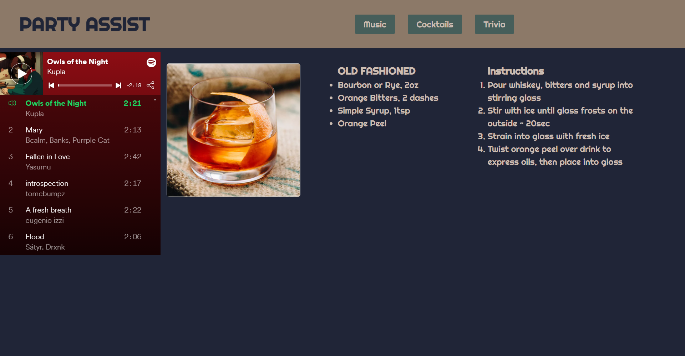

# Party Assist

## Description
An application to take some of the pressure off of planning a party so you can focus on socializing with your guests.

Party Assist provides:
- Music
- Cocktail Recipes
- Trivia

## Credits

Alex Christopherson:
[albenchris](https://github.com/albenchris)
- Team Lead
- Cocktail API
- Styles

<!-- Agustin Martinez:
[agustinxmtz](https://github.com/agustinxmtz)
- Responsive Design -->

Anthony Martinez:
[Anthonyz28](https://github.com/Anthonyz28)
- Music API

James Krikelas:
[jkrikelas](https://github.com/jkrikelas)
- Trivia API

### Screenshot

### Link
[Party Assist](https://albenchris.github.io/party-assist/)

### Technologies
- JavaScript
- HTML5
- CSS3
- [Pure CSS](https://purecss.io/)
- [Spotify API](https://developer.spotify.com/documentation/web-api/)
- [CocktailDB](https://www.thecocktaildb.com/api.php)
- [Open Trivia DB](https://opentdb.com/)
